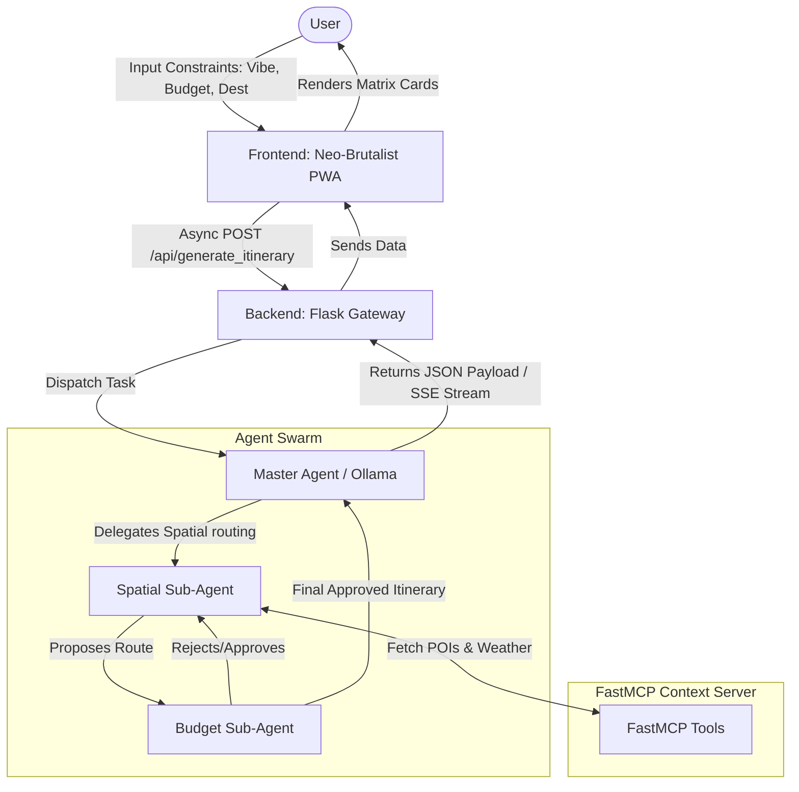

# Wrangler Architecture

Wrangler is an autonomous travel logistics agent designed to create hyper-optimized vacation blueprints based on user vibe and budget constraints. The system consists of four main layers:

## High-Level System Flow

## 1. Frontend (Neo-Brutalist PWA)
- **Technology:** HTML, Vanilla JavaScript, Tailwind CSS, Vite (build tool), Service Worker, IndexedDB.
- **Design:** A strict Neo-Brutalist aesthetic featuring high-contrast colors (e.g., `#FFFFF0` backgrounds, `#000000` hard borders, flat shadows) optimized for bright sunlight and low battery drain.
- **Offline Strategy:** Service worker caches critical assets and map tiles (via `leaflet-offline`). User data (itineraries, journals) is stored in IndexedDB.
- **Interaction:** Communicates with the backend via REST and Server-Sent Events (SSE) for streaming LLM responses.

## 2. Backend API Gateway
- **Technology:** Python, Flask, SQLite.
- **Role:** Serves as the bridge between the frontend PWA and the local agent engine. Manages state and data persistence via SQLite.
- **Core Endpoint:** An `/api/generate_itinerary` endpoint that ingests user constraints (Vibe, Budget, Destination) and dispatches the task to the Master Agent. It utilizes Flask's generator support to stream responses via SSE back to the client.

## 3. Agent Orchestration Engine
- **Technology:** Ollama SDK (for local LLM execution, utilizing Qwen3.5) and MCP (Model Context Protocol).
- **Agents:**
  - **Master Agent:** Coordinates the flow, interprets the user vibe, and formats the final payload.
  - **Spatial Sub-Agent:** Interfaces with the MCP Server to gather geocoded POIs, proposing a logical route sequence.
  - **Budget Sub-Agent:** Audits the itinerary against the user's budget constraints.

### A2A Negotiation Loop

## 4. Context Enrichment & External APIs
- **FastMCP Server:** Exposes tools such as `get_weather`, `get_pois`, and `calculate_transit_cost` to ground the LLM's outputs.
- **External Services:**
  - **OpenWeather / Open-Meteo:** Real-time and forecasted weather data.
  - **Booking.com (RapidAPI):** Accommodation search and pricing.
  - **OSM Overpass API:** Verification for FR-5 (SOS Protocol) emergency facility locations.
