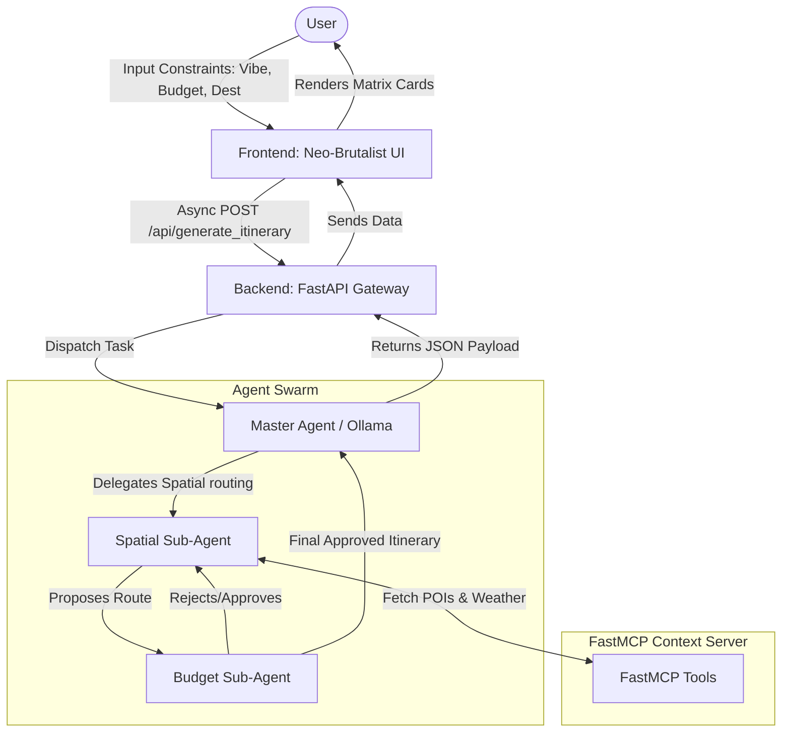
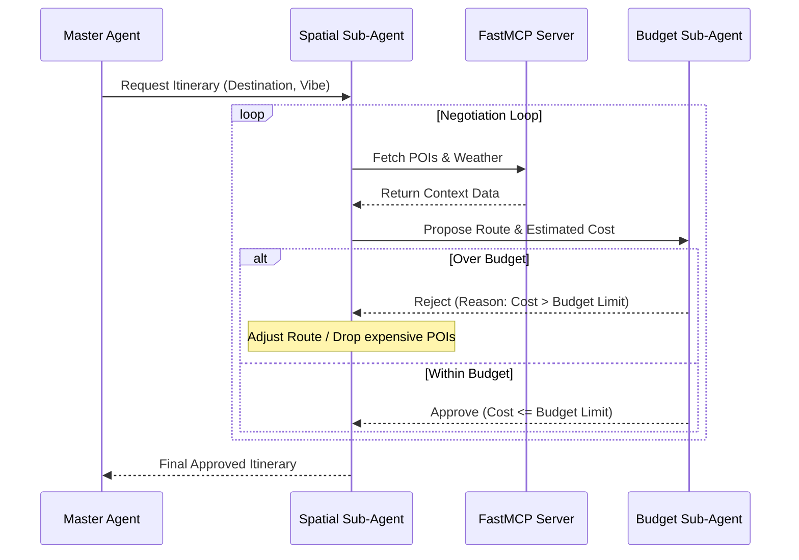

# Wrangler Architecture

Wrangler is an autonomous travel logistics agent designed to create hyper-optimized vacation blueprints based on user vibe and budget constraints. The system consists of three main layers:

## High-Level System Flow

## 1. Frontend (Neo-Brutalist UI)
- **Technology:** HTML, Vanilla JavaScript/TypeScript, and Tailwind CSS (v3.4 via CDN).
- **Design:** A strict Neo-Brutalist aesthetic featuring high-contrast colors (e.g., `#FFFFF0` backgrounds, `#000000` hard borders, offset shadows) to give the application a distinct, raw look.
- **Interaction:** Communicates asynchronously with the backend API to generate and render itinerary matrix cards dynamically.

## 2. Backend API Gateway
- **Technology:** FastAPI, Uvicorn, Pydantic.
- **Role:** Serves as the bridge between the frontend and the agent engine. 
- **Core Endpoint:** An asynchronous `/api/generate_itinerary` endpoint that ingests user constraints (Vibe Vector, Budget, and Destination) and dispatches the task to the Master Agent.

## 3. Agent Orchestration Engine
- **Technology:** Ollama SDK (for local LLM agent execution) and MCP (Model Context Protocol).
- **Agents:**
  - **Master Agent:** Coordinates the flow, interprets the user vibe, and formats the final payload for the frontend.
  - **Spatial Sub-Agent:** Interfaces with the MCP Server to gather geocoded Points of Interest (POIs) and historical weather, proposing a logical route sequence.
  - **Budget Sub-Agent:** Audits the itinerary against the user's budget constraints.

### A2A Negotiation Loop

## 4. Context Enrichment (FastMCP Server)
- **Role:** Provides context and external data to the sub-agents.
- **Functions:** Exposes tools such as `get_historical_weather`, `get_points_of_interest`, and `calculate_transit_cost` to ground the LLM's outputs in real-world constraints.